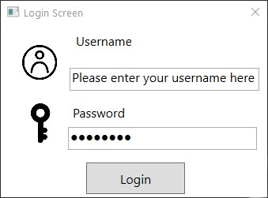
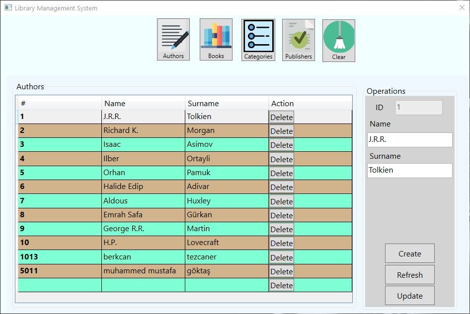
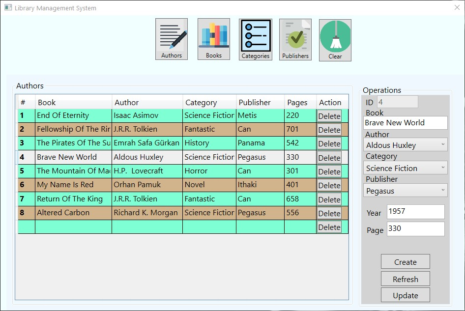
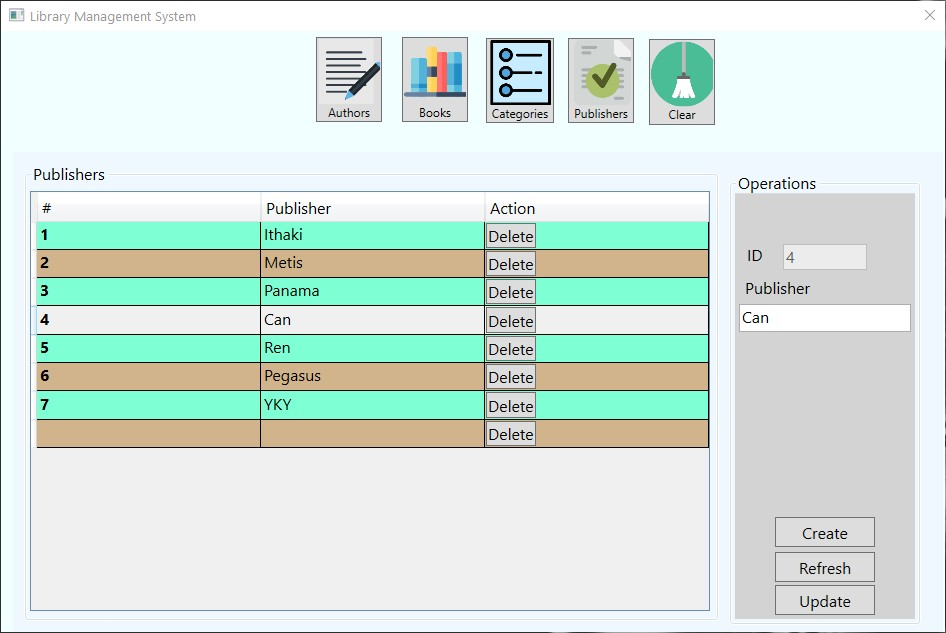
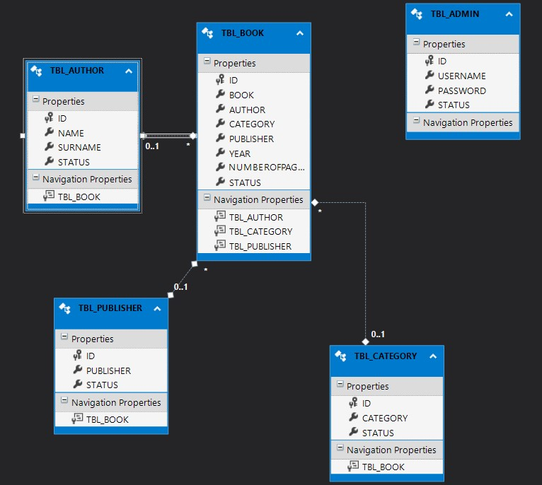

# WPF Library Management System

A Library Management Application Using .NET Framework 4.8, ADO.NET DB-First, WPF, Entity Framework.

App consists of one login window and a content window. In content window corresponding pages are called into frame. Book table has authors, categories and publishers foreign keys. All of the CRUD operations work on all of the tables.

## Preview

## Screenshots

---

