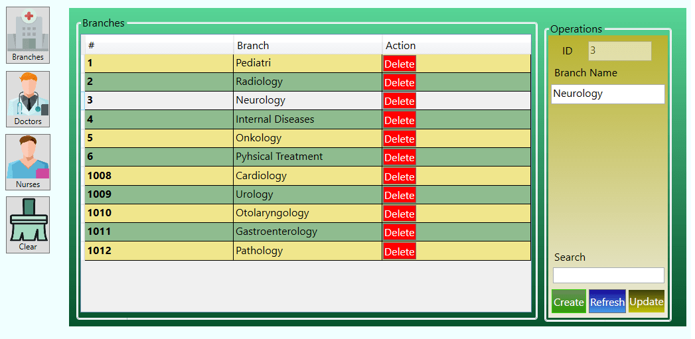
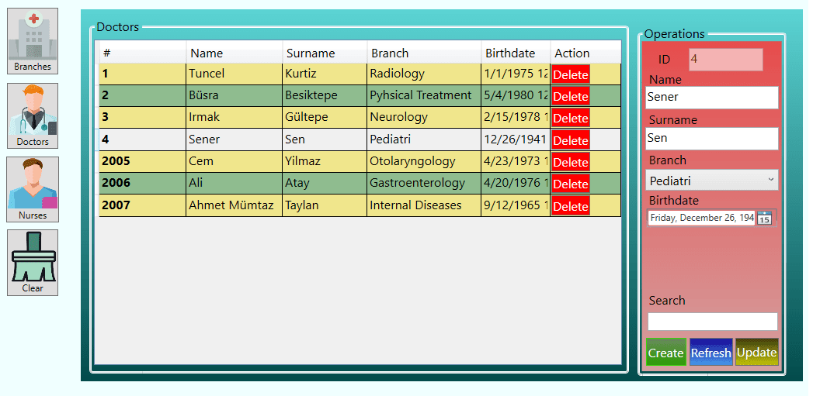
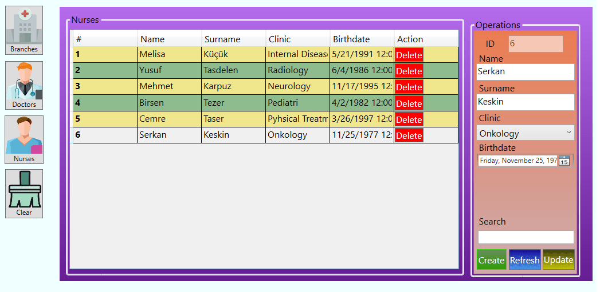
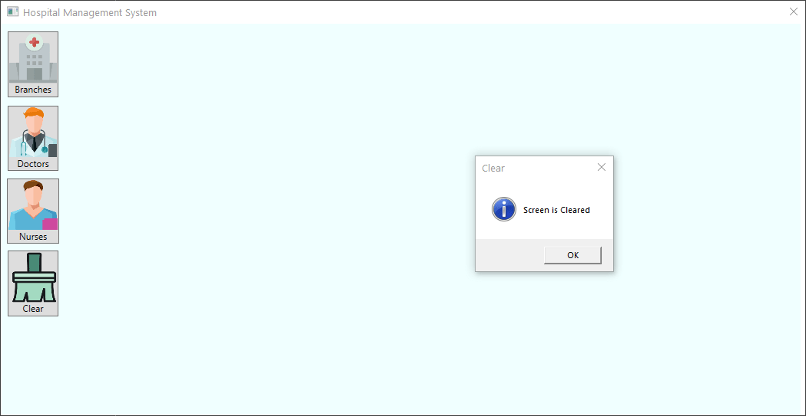
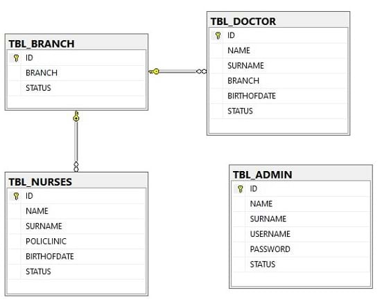
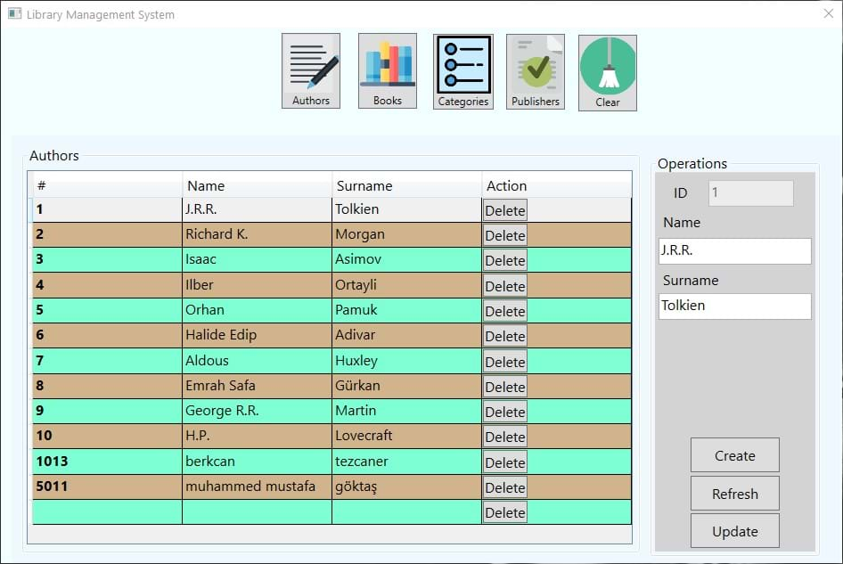
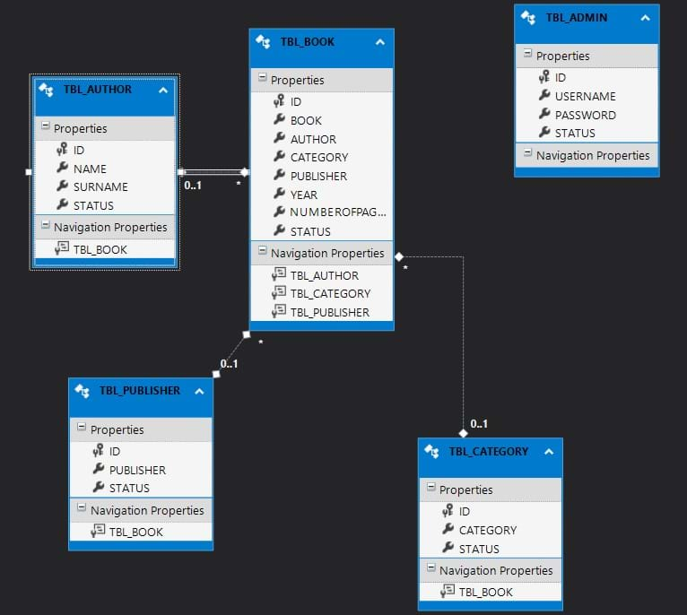

# WPF APPLICATIONS

This repo contains two projects for WPF learning purposes. A Library Management App and a Hospital Management App. Hospital app uses new .NET 5.0 (formerly core) dotnet ef Scaffold, Entity Framework Core, SQL Server. Library app uses old .NET 4.8 Framework, ADO.NET Db-First, Entity Framework, SQL Server.

## WPF Hospital Management System

* A Hospital Management Application Using .NET 5.07, Entity Framework Core, WPF.

* App consists one login window and a content window. In content windows corresponding pages age called into frame. Doctors and Nurses tables have foreign key for branch table. All the CRUD operations work on all of the tables. Also has search function for all the tables.

### Preview

### Screenshots

---

## WPF Library Management System

- A Library Management Application Using .NET Framework 4.8, ADO.NET DB-First, WPF, Entity Framework.

- App consists of one login window and a content window. In content window corresponding pages are called into frame. Book table has authors, categories and publishers foreign keys. All of the CRUD operations work on all of the tables.

### Preview

### Screenshots

---

